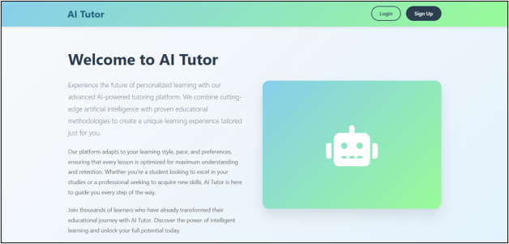
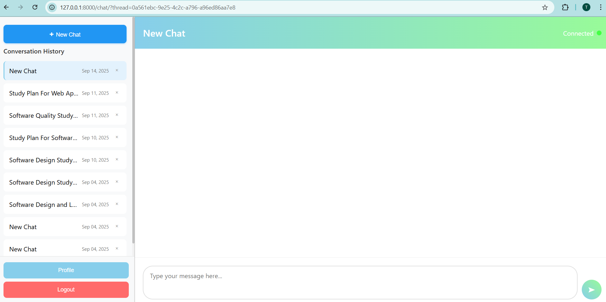
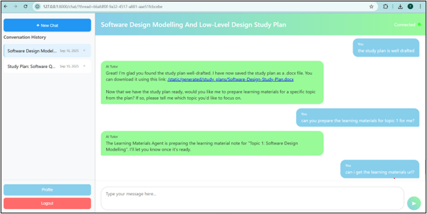
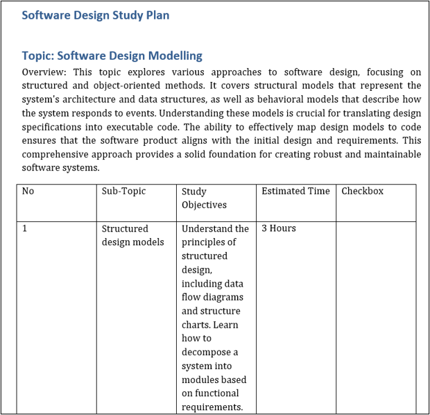
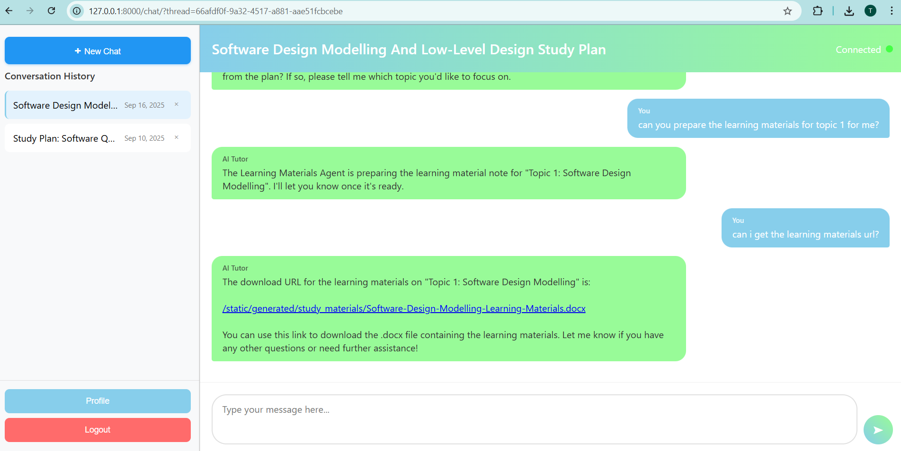
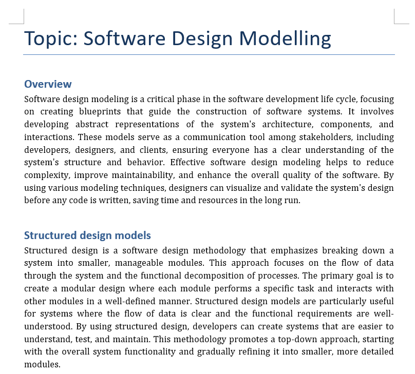
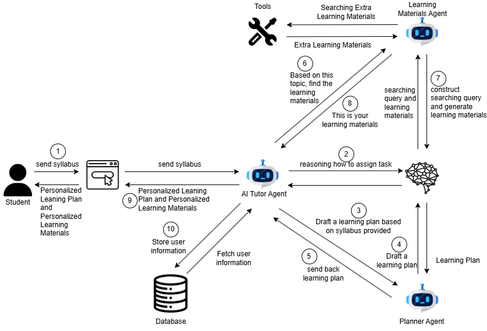
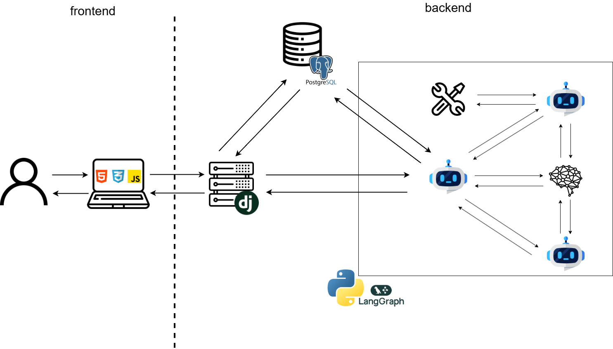
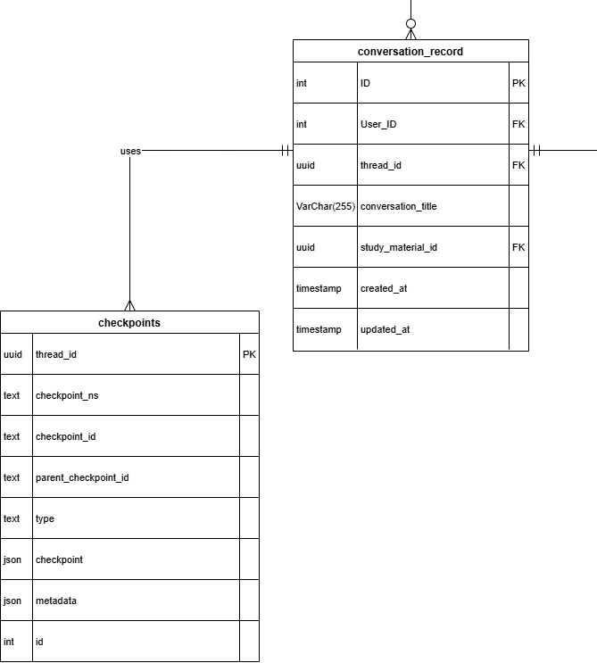

# 🎓 Agentic AI-Powered Personalized Tutor

This project aims to develop an Agentic AI-powered personalized tutoring web application for university students. By implementing Agentic AI technology, the tutoring web application will be able to provide personalized learning materials, 24/7 real-time feedback, and deliver cross-domain learning resources.
---

## 🛠️ Tech Stack

- **Agent Orchestration:** LangChain
- **LLM Engine:** Gemini API
- **Search Tool for Agent:** Tavily API
- **Database:** PostgreSQL
- **Backend:** Django
- **Frontend:** HTML, CSS, JavaScript

---

## 📌 Overview

   
  <em>Figure 1: Landing Page</em>

   
  <em>Figure 2: Chat Page</em>

   
  <em>Figure 3: Generate Learning Plan</em>

   
  <em>Figure 4: Example Study Plan</em>

   
  <em>Figure 5: Generate Learning Material</em>

   
  <em>Figure 6: Example Learning Material</em>

---

## ✨ Key Features

- **Syllabus Analysis:** Analyzes student-uploaded course syllabi to determine learning goals, gaps, and core requirements.
- **Dynamic Learning Paths:** Generates step-by-step, customized study roadmaps tailored to individual student needs.
- **Automated Note Generation:** Produces comprehensive, downloadable study notes (`.docx`) strictly aligned with the generated learning path.
- **24/7 Real-Time Feedback:** Offers continuous guidance and cross-domain learning resources.

---

## 🏗️ System Architecture

   
  <em>Agent Worfklow</em>

   
  <em>System Architecture</em>

### Agent Roles & Responsibilities

1. **AI Tutor Agent (Coordinator)**
   - Manages direct interaction with the student.
   - Coordinates with the **Planner Agent** and **Learning Materials Agent** to orchestrate personalized learning plans and deliver tailored content.

2. **Planner Agent**
   - Deconstructs complex subjects and syllabi into manageable, step-by-step learning modules.
   - Ensures a logical learning progression so students can master foundational concepts before advancing.

3. **Learning Materials Agent**
   - Searches for and retrieves high-quality educational resources aligned with the student's learning goals.
   - Curates and validates materials for accuracy and relevance.

---

## ⚙️ Key Technical Challenges & Solutions

### Challenge: Efficient Conversation History & State Management in LangChain
Integrating standard relational database storage (PostgreSQL) with LangChain’s built-in checkpointing mechanisms (used for agent memory and long-term state persistence) created risk for redundant data storage and state synchronization issues.

### Solution: Hybrid Thread-ID Referencing
To keep the database schema clean and avoid duplicating message data, the primary application database does not store individual raw chat messages. Instead, the `ConversationRecord` database table stores a unique `thread_id` that references the native LangChain PostgreSQL checkpoint table. 

When a user opens a chat session, Django queries the `thread_id`, allowing LangChain to natively load the state history, render past messages, and execute agent workflows with context preservation.

   
  <em>Database Design</em>

